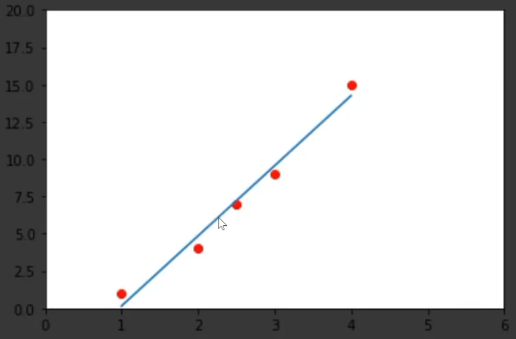

# [Machine Learning with Python](https://www.freecodecamp.org/learn/machine-learning-with-python/)

**Provider:** [FreeCodeCamp](https://www.freecodecamp.org/learn)

**NOTE:** Some elements of this cert are based on older versions of TensorFlow. Instructions for migration to more recent versions are [here](https://www.tensorflow.org/guide/migrate).

## Contents

<details>
<summary>View</summary>

- [Introduction: Machine Learning Fundamentals](#introduction-machine-learning-fundamentals)
- [Introduction to TensorFlow](#introduction-to-tensorflow)
- [Core Learning Algorithms](#core-learning-algorithms)
- [Core Learning Algorithms: Working with Data](#core-learning-algorithms-working-with-data)
- [Core Learning Algorithms: Training and Testing Data](#core-learning-algorithms-training-and-testing-data)
- [Core Learning Algorithms: The Training Process](#core-learning-algorithms-the-training-process)
- [Core Learning Algorithms: Classification](#core-learning-algorithms-classification)
- [Core Learning Algorithms: Building the Model](#core-learning-algorithms-building-the-model)
- [Core Learning Algorithms: Clustering](#core-learning-algorithms-clustering)
- [Core Learning Algorithms: Hidden Markov Models](#core-learning-algorithms-hidden-markov-models)
- [Core Learning Algorithms: Using Probabilities to make Predictions](#core-learning-algorithms-using-probabilities-to-make-predictions)
- [Neural Networks with TensorFlow](#neural-networks-with-tensorflow)
- [Neural Networks: Activation Functions](#neural-networks-activation-functions)
- [Neural Networks: Optimizers](#neural-networks-optimizers)
- [Neural Networks: Creating a Model](#neural-networks-creating-a-model)
- [Convolutional Neural Networks](#convolutional-neural-networks)
- [Convolutional Neural Networks: The Convolutional Layer](#convolutional-neural-networks-the-convolutional-layer)
- [Creating a Convolutional Neural Network](#creating-a-convolutional-neural-network)
- [Convolutional Neural Networks: Evaluating the Model](#convolutional-neural-networks-evaluating-the-model)
- [Convolutional Neural Networks: Picking a Pretrained Model](#convolutional-neural-networks-picking-a-pretrained-model)
- [Natural Language Processing With RNNs](#natural-language-processing-with-rnns)
- [Natural Language Processing With RNNs: Part 2](#natural-language-processing-with-rnns-part-2)
- [Natural Language Processing With RNNs: Recurring Neural Networks](#natural-language-processing-with-rnns-recurring-neural-networks)
- [Natural Language Processing With RNNs: Sentiment Analysis](#natural-language-processing-with-rnns-sentiment-analysis)
- [Natural Language Processing With RNNs: Making Predictions](#natural-language-processing-with-rnns-making-predictions)
- [Natural Language Processing With RNNs: Create a Play Generator](#natural-language-processing-with-rnns-create-a-play-generator)
- [Natural Language Processing With RNNs: Building the Model](#natural-language-processing-with-rnns-building-the-model)
- [Natural Language Processing With RNNs: Training the Model](#natural-language-processing-with-rnns-training-the-model)
- [Reinforcement Learning With Q-Learning](#reinforcement-learning-with-q-learning)
- [Reinforcement Learning With Q-Learning: Part 2](#reinforcement-learning-with-q-learning-part-2)
- [Reinforcement Learning With Q-Learning: Example](#reinforcement-learning-with-q-learning-example)
- [Conclusion](#conclusion)
- [How Neural Networks Work](#how-neural-networks-work)
- [Machine Learning with Python Projects](#machine-learning-with-python-projects)
</details>

## Introduction: Machine Learning Fundamentals

🎞 [VIDEO](https://youtu.be/KwL1qTR5MT8)

### Artificial Intelligence vs Machine Learning vs Neural Networks (Deep Learning)

#### AI

⌚ https://youtu.be/KwL1qTR5MT8?t=46

- simulates human behaviour
- human provides set of rules
- can be simple or complex
  - e.g. (simple) program that plays chess against human players
- no predefined set of layers (as seen in ML/NN)

#### ML

⌚ https://youtu.be/KwL1qTR5MT8?t=246

- subset of AI
- figures out the rules itself
  - based on provided input data, and expected output data
- **GOAL:** achieve highest accuracy possible
- essentially two layers: 1. feed it input --> (connected by a set of rules) --> 2. output

#### NN

⌚ https://youtu.be/KwL1qTR5MT8?t=409

- subset of ML
- "Multi Stage Information Extraction Process"
- layered representation of data
- multiple layers: input --> features extracted --> features extracted --> output
  - data is transformed between layers
  - different connections between each layer
- not modelled after the human brain

### Data

⌚ https://youtu.be/KwL1qTR5MT8?t=66

- most important thing for ML
- **Features** = input data
  - data we always have
- **Labels** = output data
  - representing what we want to look out for
- tons of data is required to create rules for **data sets**
  - training data contains the Features AND Labels
  - testing data contains only the Features

#### Example: Student Exam Results Data Set

Exam results for three students, across three tests.

| Student | Test 1 | Test 2 | Test 3 |
| ------- | ------ | ------ | ------ |
| Bob     | 70     | (80)   | 77     |
| Sue     | 60     | (90)   | 84     |
| Tim     | 40     | (50)   | 38     |

**The Problem:** We only have their Test 1 and Test 3 scores. _How can we predict their Test 2 score?_

**Features:** (input data) test 1, test 3

**Label:** (output data) test 2

---

## 🛑 Progress Check

Which statement below is **false**?

1. Neural networks are modelled after the way the human brain works.
2. Computer programs that play tic-tac-toe or chess against human players are examples of simple artificial intelligence.
3. Machine learning is a subset of artificial intelligence.

<details>
<summary>Answer</summary>

_1 is false._

</details>

---

## Introduction to TensorFlow

🎞 [VIDEO](https://youtu.be/r9hRyGGjOgQ)
📖 [TensorFlow](https://www.tensorflow.org/guide/tensor)

### Terminology

#### Main

| Term      | Definition                                                                      |
| --------- | ------------------------------------------------------------------------------- |
| Tensor    | A vector generalised to higher dimensions                                       |
|           | The main object that's passed around in our program                             |
|           | Represents a partially defined computation that will eventually produce a value |
| Data Type | What kind of info is stored in the Tensor                                       |
|           | Often numbers (float32, int32) but can also be strings and others               |
| Shape     | Represents the dimension of the data                                            |
|           | The length (number of elements) of each axis                                    |
| Session   | Used to evaluate a tensor                                                       |

#### Ranks

| Name   | Rank   | Example                                                                 |
| ------ | ------ | ----------------------------------------------------------------------- |
| Scalar | rank-0 | `rank0_tensor = tf.Variable("This is a string", tf.string)`             |
|        |        | A Scalar string                                                         |
| Vector | rank-1 | `rank1_tensor = tf.Variable(["test", "hello", "mary"], tf.string)`      |
|        |        | A Vector of strings                                                     |
| Matrix | rank-2 | `rank2_tensor = tf.Variable([["hi", "bye"], ["yes", "no"]], tf.string)` |
|        |        | A Matrix of strings                                                     |
| 3D     | rank-3 | `tf.Variable([[[1]],[[2]],[[3]]], dtype=tf.int32)`                      |
|        |        | A 3D tensor of integers                                                 |

#### Shapes

| Term           | Definition                                                                                                           |
| -------------- | -------------------------------------------------------------------------------------------------------------------- |
| Shape          | "The length (number of elements) of each of the axes of a tensor." (TensorFlow.org, 2023)                            |
| Rank           | "Number of tensor axes. A scalar has rank 0, a vector has rank 1, a matrix is rank 2." (TensorFlow.org, 2023)        |
| Axis/Dimension | "A particular dimension of a tensor." (TensorFlow.org, 2023)                                                         |
|                | `tf.Variable([["hi", "bye"], ["yes", "no"]], tf.string)` has 2 dimensions, each dimension has a size of 2 (elements) |
| Size           | "The total number of items in the tensor, the product of the shape vector's elements." (TensorFlow.org, 2023)        |

#### Types

⌚ https://youtu.be/r9hRyGGjOgQ?t=712

_There are other types not covered here._

| Name         | Characteristic | Purpose | Example                      |
| ------------ | -------------- | ------- | ---------------------------- |
| Variable     | mutable        |         | `tf.Variable(324, tf.int16)` |
| Constant     | immutable      |         |                              |
| Placeholder  | immutable      |         |                              |
| SparseTensor | immutable      |         |                              |

#### OTHER

| Term             | Definition                                                                         |
| ---------------- | ---------------------------------------------------------------------------------- |
| Feature column   | The heading of a column (in a table, spreadsheet, csv file)                        |
| Categorical data | Any data that is not numeric                                                       |
| Numeric data     | Any data that is numeric                                                           |
| Epoch            | One stream of an entire dataset.                                                   |
|                  | The number of epochs defines how many times the model will see the entire dataset. |

### Creating Tensors

⌚ https://youtu.be/r9hRyGGjOgQ?t=172

**Scalar (rank-0)**

- contains a single value
- no axes

```python
# tensor = tf.Variable(VALUE, DATA_TYPE)
string = tf.Variable("this is a string", tf.string)
number = tf.Variable(324, tf.int16) # default is int32
floating = tf.Variable(3.145, tf.float64)
```

**Vector (rank-1)**

- contains a list/array of values
- one axis

```python
# Let's make this a float tensor.
rank_1_tensor = tf.constant([2.0, 3.0, 4.0]) # array
print(rank_1_tensor)
```

**Matrix (rank-2)**

- contains a nested list of values
- two axes

```python
# If you want to be specific, you can set the dtype at creation time
rank_2_tensor = tf.constant([[1, 2],
                             [3, 4],
                             [5, 6]], dtype=tf.float16)
print(rank_2_tensor)
```

**3D Tensor (rank-3)**

- more than 2 axes

```python
# There can be an arbitrary number of
# axes (sometimes called "dimensions")
rank_3_tensor = tf.Variable([[[1, 2, 3], [4, 5, 6]], [[7, 8, 9], [10, 11, 12]]], dtype=tf.int32)

print(rank_3_tensor)
```

```python
# The paired dimensions must be the same size (i.e. number of elements in each = 3)
tensor_bool = tf.Variable([[[True, False, True], [False, True, False]], [[True, True, False], [False, False, True]]], dtype=tf.bool)
```

### Useful Snippets

**Get Tensor rank** ⌚ https://youtu.be/r9hRyGGjOgQ?t=354

<details>
<summary>Code</summary>

```python
# example_rank2_tensor = tf.Variable(["Yes", "No"], ["Hello", "Goodbye"], tf.string)
tf.rank(example_rank2_tensor) # tf.rank is a method
# >>> tf.Tensor: shape=(), dtype=int32, numpy=2
# ❔ numpy is rank
```

</details>

**Get Tensor shape** ⌚ https://youtu.be/r9hRyGGjOgQ?t=395

<details>
<summary>Code</summary>

```python
# example_rank2_tensor = tf.Variable([["Yes", "No"], ["Hello", "Goodbye"]], tf.string)
example_rank2_tensor.shape # shape is an attribute
# >>> TensorShape([2, 2])
# ❔ 2 dimensions, 2 elements in each
```

```python
# example_rank1_tensor = tf.Variable(["Yes", "No", "wtf"], tf.string)
example_rank1_tensor.shape
# >>> TensorShape([3])
# ❔ 1 dimension, 3 elements
```

</details>

**Change Tensor shape** ⌚ https://youtu.be/r9hRyGGjOgQ?t=512

_Number of elements in reshaped tensor must match the original._

<details>
<summary>Code</summary>

```python
# Create a shape [1,2,3] tensor full of ones
tensor1 = tf.ones([1,2,3]) # 1 x 2 = 2 x 3 = 6 (total elements)
# Reshape existing data to shape [2,3,1]
tensor2 = tf.reshape(tensor1, [2,3,1]) # 2 x 3 = 6 x 1 = 6 (total elements)
# Reshape the tensor to [3,2]
tensor3 = tf.reshape(tensor2, [3, -1]) # -1 means the tensor can calculate the rest
```

```python
print(tensor1)
# tf.Tensor(
#   [[[1. 1. 1.]
#     [1. 1. 1.]]], shape=(1, 2, 3), dtype=float32)
# ❔ 1 list, 2 lists inside that, 3 elements in each of those (total of 6 elements that we can reshape)
print(tensor2)
# tf.Tensor(
#   [[[1.]
#     [1.]
#     [1.]]
#
#    [[1.]
#     [1.]
#     [1.]]], shape=(2, 3, 1), dtype=float32)
# ❔ 2 lists, 3 lists inside those, 1 element in each of those
print(tensor3)
# tf.Tensor(
#   [[1. 1.]
#    [1. 1.]
#    [1. 1.]], shape=(3,2), dtype=float32)
# ❔ 3 lists (the tensor figured out how many elements in each)
```

</details>

**Run Tensor session (Evaluate a Tensor)** ⌚ https://youtu.be/r9hRyGGjOgQ?t=787

<details>
<summary>Code</summary>

```python
# Create a session using the default graph
with tf.Session() as sess:
    tensor.eval() # replace 'tensor' with name of the tensor we want to eval
```

</details>

---

## 🛑 Progress Check

Which of the following is **not** a type of tensor?

1. Variable
2. Flowing
3. Placeholder
4. SparseTensor
5. Constant

<details>
<summary>Answer</summary>

_Flowing is not a type of tensor._

</details>

---

## Core Learning Algorithms

🎞 [VIDEO](https://youtu.be/u5lZURgcWnU)

👩‍💻 [CODE ACTIVITY 1](code-activities/cla1.py)

### TensorFlow fundamental ML algorithms

There are thousands of algorithms, but the main categories are:

- Linear Regression (covered in next 3 sections)
  - [Working with Data](#core-learning-algorithms-working-with-data)
  - [Training and Testing Data](#core-learning-algorithms-training-and-testing-data)
  - [The Training Process](#core-learning-algorithms-the-training-process)
- [Classification](#core-learning-algorithms-classification)
- [Clustering](#core-learning-algorithms-clustering)
- [Hidden Markov Models](#core-learning-algorithms-hidden-markov-models)

#### Linear Regression ⌚ https://youtu.be/u5lZURgcWnU?t=167

- used to predict numeric values
- data points are related linearly (image: points in red)
- create a _line of best fit_ for the dataset (image: line in blue):

  - line is positioned as close to every data point as possible
  - line splits the total number of data points as evenly as possible

    

  - line is defined by `y = mx + b`

    - [Khan Academy: Intro to slope-intercept form](https://www.khanacademy.org/math/algebra/x2f8bb11595b61c86:forms-of-linear-equations/x2f8bb11595b61c86:intro-to-slope-intercept-form/v/slope-intercept-form)
    - [Math is Fun: Equation of a Straight Line](https://www.mathsisfun.com/equation_of_line.html)

---

## 🛑 Progress Check

Which type of analysis would be best suited for the following problem?:

You have the average temperature in the month of March for the last 100 years. Using this data, you want to predict the average temperature in the month of March 5 years from now.

1. Multiple regression
2. Correlation
3. Decision tree
4. Linear regression

<details>
<summary>Answer</summary>

Linear regression

</details>

---

## Core Learning Algorithms: Working with Data

🎞 [VIDEO](https://youtu.be/u85IOSsJsPI)

**Note:** This is for Linear Regression algorithms.

### Pandas

- training data and testing data should be different datasets
  - otherwise, it may have just memorised the input and output data
  - training dataset is larger than the testing one

```python
# Load dataset
dftrain = pd.read_csv('train.csv') # training data (in pandas data frame object)
dftest = pd.read_csv('eval.csv') # testing data (in pandas data frame object)
print(dftrain.head()) # print out the first 5 rows of the pandas data frame
y_train = dftrain.pop('survived') # grab only the survived column from the dta frame
y_eval = dfeval.pop('survived')
# Combine the 1st row from dftrain, with the 1st row of y_train
print(dftrain.loc[0], y_train.loc[0]) # return a single row (zero-indexed)
print(dftrain["age"]) # returns all results from the 'age' column
# RESULT: This person, with this data (dftrain), had this 'survived' status (y_train)
```

#### .head()

⌚ https://youtu.be/u85IOSsJsPI?t=325

- returns the first 5 rows/entries of data frame

#### .describe()

⌚ https://youtu.be/u85IOSsJsPI?t=629

- returns a more statistical analysis of the data

#### .shape()

⌚ https://youtu.be/u85IOSsJsPI?t=669

- returns the shape of the dataset

---

## 🛑 Progress Check

What does the pandas .head() function do?

1. Returns the number of entries in a data frame.
2. Returns the number of columns in a data frame.
3. By default, shows the first five rows or entries in a data frame.

<details>
<summary>Answer</summary>

Shows the first five rows or entries in a data frame.

</details>

---

## Core Learning Algorithms: Training and Testing Data

🎞 [VIDEO](https://youtu.be/wz9J1slsi7I)

**Note:** This is for Linear Regression algorithms.

### Feature Columns

- in a CSV file, they're just the various column headings

### Categorical data

- anything that is not numeric (i.e. Numeric data)
- must be converted into numeric data before we start training
  - encode using an integer value
    e.g. male = 0, female = 1; first = 2, second = 1, third = 3

```python
CATEGORICAL_COLUMNS = ['sex', 'n_siblings_spouses', 'parch', 'class', 'deck', 'embark_town', 'alone']
NUMERIC_COLUMNS = ['age', 'fare']

feature_columns = []
for feature_name in CATEGORICAL_COLUMNS:
  vocabulary = dftrain[feature_name].unique() # get a list of all unique values from given feature column
  # Make feature columns for linear regression
  feature_columns.append(tf.feature_column.categorical_column_with_vocabulary_list(feature_name, vocabulary))

for feature_name in NUMERIC_COLUMNS:
  feature_columns.append(tf.feature_column.numeric_column(feature_name, dtype=tf.float32))

print(feature_columns)
```

```python
print(dftrain["embark_town"].unique()) # array(['Southampton', 'Cherbourg', 'unknown'], dtype=object)
```

---

## 🛑 Progress Check

What is categorical data?

1. Another term for one-hot encoding.
2. Any data that is not numeric.
3. Any data that is represented numerically.

<details>
<summary>Answer</summary>

Any data that is not numeric.

</details>

---

## Core Learning Algorithms: The Training Process

🎞 [VIDEO](https://youtu.be/_cEwvqVoBhI)

**Note 1:** This is for Linear Regression algorithms.

**Note 2:** Tutorial uses estimators. As per [tensorflow.org](https://www.tensorflow.org):

> **Warning:** Estimators are not recommended for new code. Estimators run **[v1.Session](https://www.tensorflow.org/api_docs/python/tf/compat/v1/Session)**-style code which is more difficult to write correctly, and can behave unexpectedly, especially when combined with TF 2 code. Estimators do fall under our [compatibility guarantees](https://tensorflow.org/guide/versions), but will receive no fixes other than security vulnerabilities. See the [migration guide](https://tensorflow.org/guide/migrate) for details.

### Training Process

- feed the model training data
- large data sets are loaded in batches of 32 entries
  - each batch is fed to model multiple times (how many times = **epoch**)

#### Input Function

⌚ https://youtu.be/_cEwvqVoBhI?t=174

- determines how the dataset is going to be broken up into epochs and batches to be fed to the model

```python
def train_input_fn():
  titanic_file = tf.keras.utils.get_file("train.csv", "https://storage.googleapis.com/tf-datasets/titanic/train.csv")
  titanic = tf.data.experimental.make_csv_dataset(
      titanic_file, batch_size=32,
      label_name="survived")
  titanic_batches = (
      titanic.cache().repeat().shuffle(500)
      .prefetch(tf.data.AUTOTUNE))
  return titanic_batches
```

(Code above is NOT from the tutorial, as per section [Note 2](#core-learning-algorithms-the-training-process) above.)

---

## 🛑 Progress Check

What are epochs?

1. The number of times the model will see the same data.
2. A type of graph.
3. The number of elements you feed to the model at once.

<details>
<summary>Answer</summary>

The number of times the model will see the same data.

</details>

---

## Core Learning Algorithms: Classification

🎞 [VIDEO](VIDEO)

### heading

#### subheading

⌚ TIMESTAMP_HERE

---

## 🛑 Progress Check

QUESTION_HERE

<details>
<summary>Answer</summary>

_ANSWER_HERE_

</details>

---

## Core Learning Algorithms: Building the Model

🎞 [VIDEO](VIDEO)

### heading

#### subheading

⌚ TIMESTAMP_HERE

---

## 🛑 Progress Check

QUESTION_HERE

<details>
<summary>Answer</summary>

_ANSWER_HERE_

</details>

---

## Core Learning Algorithms: Clustering

🎞 [VIDEO](VIDEO)

### heading

#### subheading

⌚ TIMESTAMP_HERE

---

## 🛑 Progress Check

QUESTION_HERE

<details>
<summary>Answer</summary>

_ANSWER_HERE_

</details>

---

## Core Learning Algorithms: Hidden Markov Models

🎞 [VIDEO](VIDEO)

### heading

#### subheading

⌚ TIMESTAMP_HERE

---

## 🛑 Progress Check

QUESTION_HERE

<details>
<summary>Answer</summary>

_ANSWER_HERE_

</details>

---

## Core Learning Algorithms: Using Probabilities to make Predictions

🎞 [VIDEO](VIDEO)

### heading

#### subheading

⌚ TIMESTAMP_HERE

---

## 🛑 Progress Check

QUESTION_HERE

<details>
<summary>Answer</summary>

_ANSWER_HERE_

</details>

---

## Neural Networks with TensorFlow

🎞 [VIDEO](VIDEO)

### heading

#### subheading

⌚ TIMESTAMP_HERE

---

## 🛑 Progress Check

QUESTION_HERE

<details>
<summary>Answer</summary>

_ANSWER_HERE_

</details>

---

## Neural Networks: Activation Functions

🎞 [VIDEO](VIDEO)

### heading

#### subheading

⌚ TIMESTAMP_HERE

---

## 🛑 Progress Check

QUESTION_HERE

<details>
<summary>Answer</summary>

_ANSWER_HERE_

</details>

---

## Neural Networks: Optimizers

🎞 [VIDEO](VIDEO)

### heading

#### subheading

⌚ TIMESTAMP_HERE

---

## 🛑 Progress Check

QUESTION_HERE

<details>
<summary>Answer</summary>

_ANSWER_HERE_

</details>

---

## Neural Networks: Creating a Model

🎞 [VIDEO](VIDEO)

### heading

#### subheading

⌚ TIMESTAMP_HERE

---

## 🛑 Progress Check

QUESTION_HERE

<details>
<summary>Answer</summary>

_ANSWER_HERE_

</details>

---

## Convolutional Neural Networks

🎞 [VIDEO](VIDEO)

### heading

#### subheading

⌚ TIMESTAMP_HERE

---

## 🛑 Progress Check

QUESTION_HERE

<details>
<summary>Answer</summary>

_ANSWER_HERE_

</details>

---

## Convolutional Neural Networks: The Convolutional Layer

🎞 [VIDEO](VIDEO)

### heading

#### subheading

⌚ TIMESTAMP_HERE

---

## 🛑 Progress Check

QUESTION_HERE

<details>
<summary>Answer</summary>

_ANSWER_HERE_

</details>

---

## Creating a Convolutional Neural Network

🎞 [VIDEO](VIDEO)

### heading

#### subheading

⌚ TIMESTAMP_HERE

---

## 🛑 Progress Check

QUESTION_HERE

<details>
<summary>Answer</summary>

_ANSWER_HERE_

</details>

---

## Convolutional Neural Networks: Evaluating the Model

🎞 [VIDEO](VIDEO)

### heading

#### subheading

⌚ TIMESTAMP_HERE

---

## 🛑 Progress Check

QUESTION_HERE

<details>
<summary>Answer</summary>

_ANSWER_HERE_

</details>

---

## Convolutional Neural Networks: Picking a Pretrained Model

🎞 [VIDEO](VIDEO)

### heading

#### subheading

⌚ TIMESTAMP_HERE

---

## 🛑 Progress Check

QUESTION_HERE

<details>
<summary>Answer</summary>

_ANSWER_HERE_

</details>

---

## Natural Language Processing With RNNs

🎞 [VIDEO](VIDEO)

### heading

#### subheading

⌚ TIMESTAMP_HERE

---

## 🛑 Progress Check

QUESTION_HERE

<details>
<summary>Answer</summary>

_ANSWER_HERE_

</details>

---

## Natural Language Processing With RNNs: Part 2

🎞 [VIDEO](VIDEO)

### heading

#### subheading

⌚ TIMESTAMP_HERE

---

## 🛑 Progress Check

QUESTION_HERE

<details>
<summary>Answer</summary>

_ANSWER_HERE_

</details>

---

## Natural Language Processing With RNNs: Recurring Neural Networks

🎞 [VIDEO](VIDEO)

### heading

#### subheading

⌚ TIMESTAMP_HERE

---

## 🛑 Progress Check

QUESTION_HERE

<details>
<summary>Answer</summary>

_ANSWER_HERE_

</details>

---

## Natural Language Processing With RNNs: Sentiment Analysis

🎞 [VIDEO](VIDEO)

### heading

#### subheading

⌚ TIMESTAMP_HERE

---

## 🛑 Progress Check

QUESTION_HERE

<details>
<summary>Answer</summary>

_ANSWER_HERE_

</details>

---

## Natural Language Processing With RNNs: Making Predictions

🎞 [VIDEO](VIDEO)

### heading

#### subheading

⌚ TIMESTAMP_HERE

---

## 🛑 Progress Check

QUESTION_HERE

<details>
<summary>Answer</summary>

_ANSWER_HERE_

</details>

---

## Natural Language Processing With RNNs: Create a Play Generator

🎞 [VIDEO](VIDEO)

### heading

#### subheading

⌚ TIMESTAMP_HERE

---

## 🛑 Progress Check

QUESTION_HERE

<details>
<summary>Answer</summary>

_ANSWER_HERE_

</details>

---

## Natural Language Processing With RNNs: Building the Model

🎞 [VIDEO](VIDEO)

### heading

#### subheading

⌚ TIMESTAMP_HERE

---

## 🛑 Progress Check

QUESTION_HERE

<details>
<summary>Answer</summary>

_ANSWER_HERE_

</details>

---

## Natural Language Processing With RNNs: Training the Model

🎞 [VIDEO](VIDEO)

### heading

#### subheading

⌚ TIMESTAMP_HERE

---

## 🛑 Progress Check

QUESTION_HERE

<details>
<summary>Answer</summary>

_ANSWER_HERE_

</details>

---

## Reinforcement Learning With Q-Learning

🎞 [VIDEO](VIDEO)

### heading

#### subheading

⌚ TIMESTAMP_HERE

---

## 🛑 Progress Check

QUESTION_HERE

<details>
<summary>Answer</summary>

_ANSWER_HERE_

</details>

---

## Reinforcement Learning With Q-Learning: Part 2

🎞 [VIDEO](VIDEO)

### heading

#### subheading

⌚ TIMESTAMP_HERE

---

## 🛑 Progress Check

QUESTION_HERE

<details>
<summary>Answer</summary>

_ANSWER_HERE_

</details>

---

## Reinforcement Learning With Q-Learning: Example

🎞 [VIDEO](VIDEO)

### heading

#### subheading

⌚ TIMESTAMP_HERE

---

## 🛑 Progress Check

QUESTION_HERE

<details>
<summary>Answer</summary>

_ANSWER_HERE_

</details>

---

## Conclusion

🎞 [VIDEO](VIDEO)

### heading

#### subheading

⌚ TIMESTAMP_HERE

---

## 🛑 Progress Check

QUESTION_HERE

<details>
<summary>Answer</summary>

_ANSWER_HERE_

</details>

---

## How Neural Networks Work

🎞 [VIDEO](VIDEO)

### heading

#### subheading

⌚ TIMESTAMP_HERE

---

## 🛑 Progress Check

QUESTION_HERE

<details>
<summary>Answer</summary>

_ANSWER_HERE_

</details>

---

## Machine Learning with Python Projects

🎞 [VIDEO](VIDEO)

### heading

#### subheading

⌚ TIMESTAMP_HERE

---

## 🛑 Progress Check

QUESTION_HERE

<details>
<summary>Answer</summary>

_ANSWER_HERE_

</details>

---

